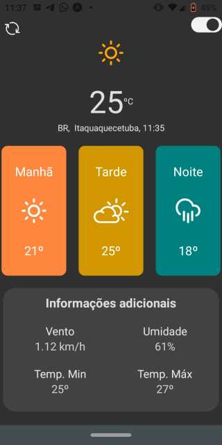
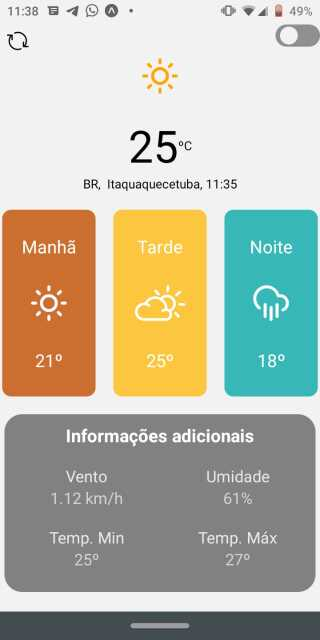
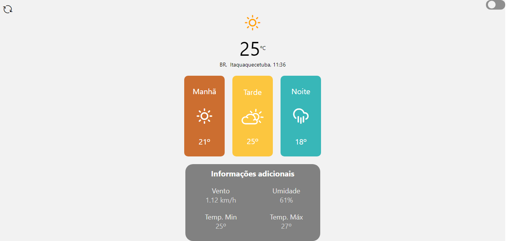
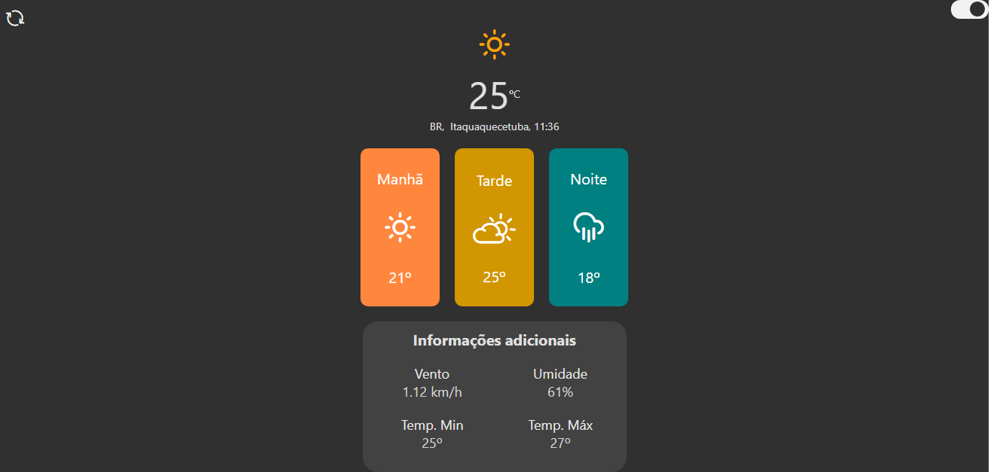

# weatherApp 

Aplicação de monitoramento climatico em tempo real.

Aplicação construida utilizando react e react-native + expo no front-end, consumindo uma API climatica.

O aplicativo recebe a geolocalização (lat,long) do usuario e mostra a localização e a situação climatica da região (Graus, temperatura máxima, temperatura minima, velocidade do vento).

API utilizada open weather map, site: "https://openweathermap.org/api".
